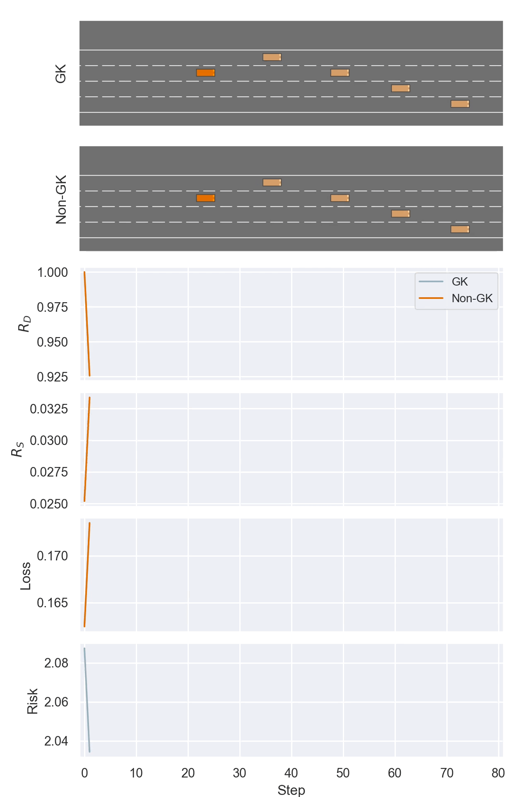

# av-agents

Modeling agentic autonomous vehicles and safety metrics under an Active Inference framework.

<div align="center">
  
</div>


## Setup

Setup is straightforward with [poetry](https://python-poetry.org/docs/).
```bash
# In project root
poetry install
```
This will install `src` modules, i.e. `sim`.  
You can then use our package modules such as `sim.models` and `sim.utils`.

### Dev
For devs, if you need to use a new package run
```bash
poetry add <package>
```
which will update the env and `pyproject.toml`.  
Or if you want finer control over the package version for instance,
you can update `pyproject.toml` directly and run `poetry update`.

## Usage

You can run simulations ad hoc with notebooks (see below), 
but you may find it easier, and it is recommended, to create scripts for your run.

See existing scripts that might be closest to your use case in the `scripts` folder, copy one and rename yours 
accordingly.
You'll want to run the scripts inside the scripts folder since it directs results into the parent directory. For 
example:

```bash
poetry shell  # Enter poetry env
cd scripts
python basic.py --config-name=highway  # not highway.yaml btw
# OR
python basic.py  # this is because we set 'highway' as the default in the basic.py hydra wrapper
```

### Configs

We use `hydra` to manage configs. It's a cool tool. Use them to configure your run, it knows to look in the 
`configs` directory automatically.

You can modify existing config arguments directly into the CLI, or add new ones with `+`:

```bash
python basic.py env.duration=10 +log_level=DEBUG
```
Notice how hydra allows you to use dot-notation in the CLI to modify nested config structs.

### Notebooks

Our package and its dependencies are accessed in a poetry env.
You can instantiate a command inside the env with `poetry run`, for example:
```bash
poetry run python  # start a python session
# or
poetry run jupyter lab
```

